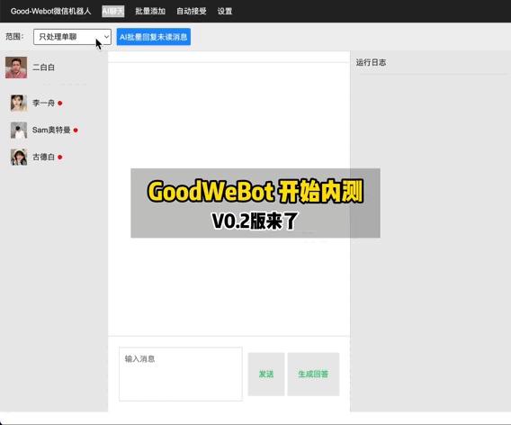

# 功能介绍
GoodWeBot 是一款基于RPA技术实现的AI微信机器人，支持AI自动回复、私聊群发和群聊群发、自动加好友、自动接受好友申请、自动给好友打标签等功能。 由白话Agent主理人古德白研发。

- 项目主页：https://github.com/ImGoodBai/GoodWeBot （需要魔法上网才能打开）
- 独立主页：http://vbot.100agent.cn （无需魔法上网）

## 特点

1. 全RPA技术实现完全合规
2. 下载一键免安装运行,使用超级简便的AI微信机器人
3. 已接入coze等主流AI
4. 免费使用

## 下载使用

1. 下载程序包，目前只支持win10、win11： https://github.com/ImGoodBai/GoodWeBot/releases/download/0.8.3/
2. 解压程序包后，进入目录双击运行 *GoodWeBot-xxx.exe*(运行前先登录微信)
3. 如果看到下面的界面，说明关联微信客户端运行成功。

4. 点击“打开应用”就可以使用AI微信机器人了。

## 软件界面和使用
1. AI生成回复 

 

2. 自动加好友 

 

3. 自动接受好友申请 

 

4. 设置提示词 

 

## 更新记录 

### GoodWeBot v0.8 20241103
1. 增加群聊自动回复。1） 先进入设置触发群聊回复的关键词；2） 进入 AI聊天>勾选“开启AI自动回复”，同时确保范围包括：群聊回复。
2. 其他一些UI布局优化
暂时无法在飞书文档外展示此内容

### GoodWeBot v0.6 20241012
1. 增加群聊群发功能（暂时限制10人），先同步好友通讯录，再同步群列表之后才可以使用。
暂时无法在飞书文档外展示此内容

### GoodWeBot v0.5 20240928
1. 优化了自动回复，限制仅支持单聊自动回复。
提醒：本次自动回复使用前，要先初始化通讯录（进群发 页面点 更新通讯录数据库）
2. 重复回复的问题，暂时没有发现，谁遇到了联系发一下。
3. 对后续功能需求有想法的欢迎联系。
一键下载包：

### v0.4.1 20240920 
1 AI聊天支持自动回复（先进去聊天页面后勾选自动聊天开启该功能）

### v0.4 20240919  
1. 增加通讯录同步（暂时限制1000条） 
2. 支持群发功能（暂时限制10人） 
3. 支持coze api测试（填写botid和token后先自测一下） 

### v0.3 20240912 
1. 升级RPA执行库
2. 开放coze api接入配置
3. 控制端应用端合为一个窗口
4. 修复备注时加好友bug

### v0.2 20240909 
* 第一个版本

## 声明

1. 本项目遵循 [GPL 3.0](/LICENSE) 开源协议，请遵守相关法律法规，不得用于任何违法或侵犯他人权益的行为仅用于技术研究和学习，使用本项目时需遵守所在地法律法规、相关政策以及企业章程，禁止用于任何违法或侵犯他人权益的行为
2. 境内使用该项目时，请使用国内厂商的大模型服务，并进行必要的内容安全审核及过滤
4. 任何个人、团队和企业，无论以何种方式使用该项目、对何对象提供服务，所产生的一切后果，本项目均不承担任何责任

## 联系我
我的微信（备注：机器人）

 

