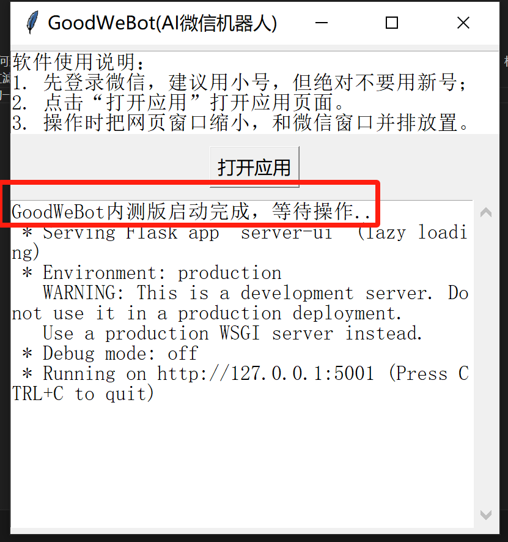
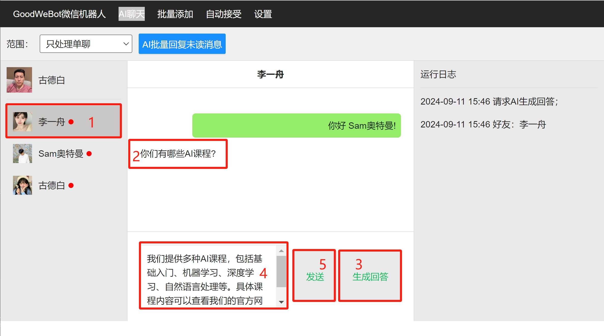
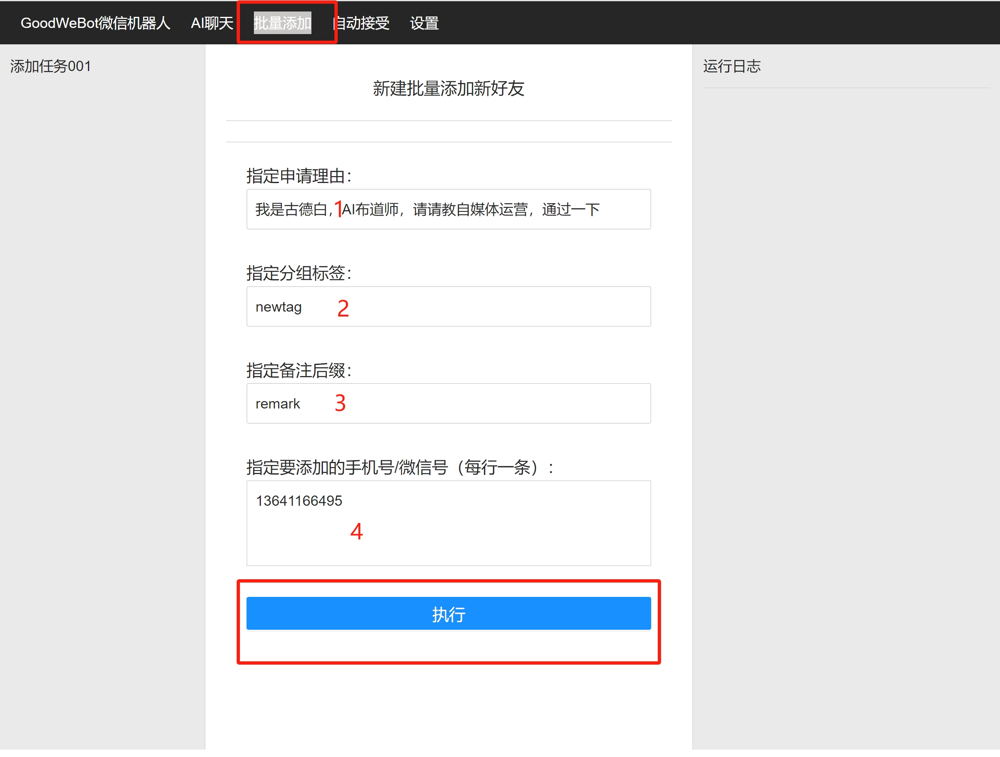
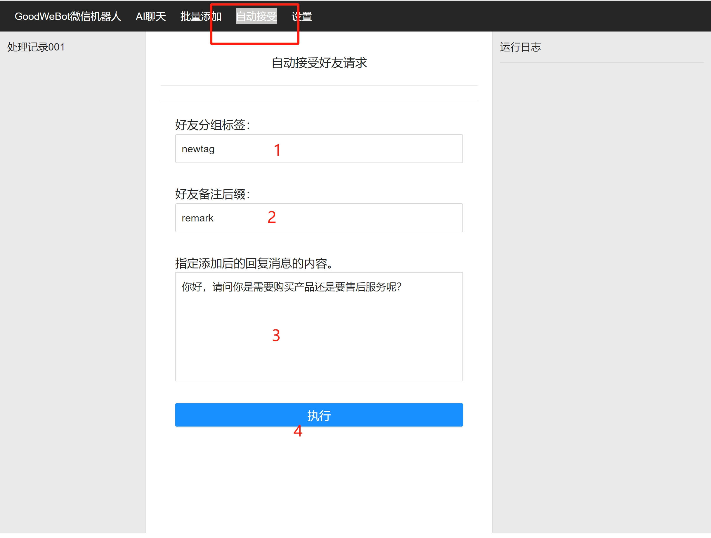
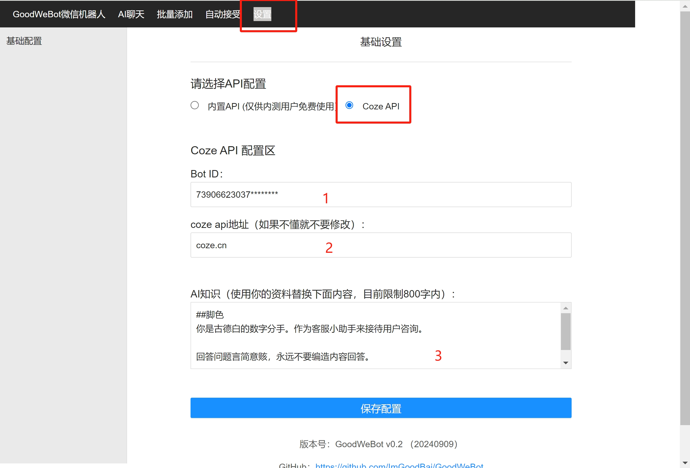

# 功能介绍
GoodWeBot 是一款基于RPA技术实现的AI微信机器人，支持AI自动回复、自动加好友、自动接受好友申请、自动给好友打标签等功能。

## 特点

1. 全RPA技术实现完全合规
2. 下载一键免安装运行,使用超级简便的AI微信机器人
3. 已接入coze等主流AI
4. 免费使用

## 下载使用

1. 下载程序包：https://github.com/ImGoodBai/GoodWeBot/archive/refs/heads/main.zip
2. 解压程序包后，进入目录双击运行 *GoodWeBot-0.3.1.exe*(运行前先登录微信)
3. 如果看到下面的界面，说明关联微信客户端运行成功。

4. 点击“打开应用”就可以使用AI微信机器人了。

## 软件界面和使用
1. AI生成回复 

 

2. 自动加好友 

 

3. 自动接受好友申请 

 

4. 设置提示词 

 

## 更新记录  
### v0.3 20240912 
1. 升级RPA执行库
2. 开放coze api接入配置
3. 控制端应用端合为一个窗口
4. 修复备注时加好友bug

### v0.2 20240909 
* 第一个版本

## 声明

1. 本项目遵循 [GPL 3.0](/LICENSE) 开源协议，请遵守相关法律法规，不得用于任何违法或侵犯他人权益的行为仅用于技术研究和学习，使用本项目时需遵守所在地法律法规、相关政策以及企业章程，禁止用于任何违法或侵犯他人权益的行为
2. 境内使用该项目时，请使用国内厂商的大模型服务，并进行必要的内容安全审核及过滤
4. 任何个人、团队和企业，无论以何种方式使用该项目、对何对象提供服务，所产生的一切后果，本项目均不承担任何责任

## 关注我了解更多搞钱项目

